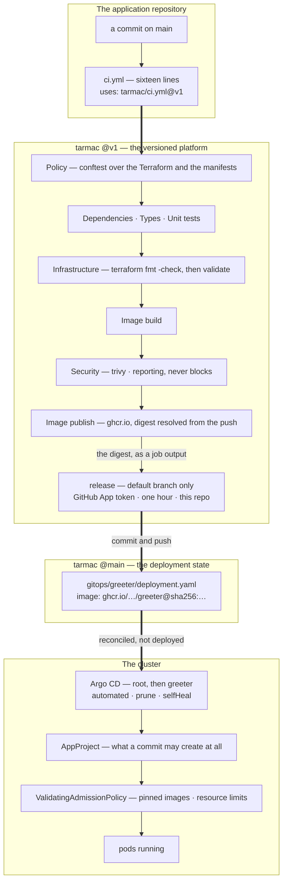

# tarmac

The paved road: the shared platform that application teams ship on top of.

Application repositories consume this platform rather than reimplementing it. They get a
tested set of quality gates, policy enforcement in CI and again at cluster admission,
infrastructure-as-code for their dependencies, and GitOps delivery — by calling a versioned
workflow, not by copying YAML.

A local environment stands in for the cloud, so the whole road can be run end to end on a
laptop with no cloud account.

## Prerequisites

| Tool | Purpose | Install |
|---|---|---|
| Docker | runs the cluster, the image builds and the local AWS stand-in | Docker Desktop |
| Bun | runs the gates | `brew install bun` |
| kind | the Kubernetes cluster | `brew install kind` |
| kubectl | talks to it | `brew install kubectl` |
| Terraform | provisions the applications' cloud dependencies, 1.11 or newer | `brew install terraform` |
| conftest | runs the policies in `policy/`, as the pipeline's first gate | `brew install conftest` |
| trivy | scans the built image, as the pipeline's one reporting gate | `brew install trivy` |

Argo CD is not on this list on purpose: `make up` installs it into the
cluster, so it costs nothing on the host. Neither is a policy engine — the cluster half of the
policy layer is a Kubernetes object the API server evaluates itself, with nothing to install.

Nothing here needs an AWS account, AWS credentials, or the AWS CLI. The stand-in accepts any
credentials and `make up` supplies throwaway ones, so a mistake in this stack cannot reach an
account that charges money.

## Getting started

```
make up         # bring the platform up and provision ../greeter's dependencies
make status     # what is running
make ci         # run the gates against ../greeter
make infra      # re-provision after changing the Terraform
make infra-plan # what provisioning would change, without changing it
make down       # tear it back down
```

`make` on its own lists the available targets. `ENV=<name>` selects an environment for the
`infra` targets; it defaults to `local`.

All of these are safe to re-run: `up` reuses an existing cluster rather than failing, `down` on
an absent one is a no-op, and a second `make infra` reports no changes.

`make down` keeps the local AWS stand-in's data volume, so Terraform state survives a teardown —
which is why a second `make up` reports no infrastructure changes rather than reprovisioning.
`scripts/localstack-down.sh --purge` discards it, and only then does the next `up` genuinely start
from nothing.

### What a good `make up` looks like

It takes about ninety seconds on a machine that has pulled the images before, and it ends here:

```
cluster   up (tarmac)
          tarmac-control-plane   Ready
admission 2 policies
            tarmac-require-pinned-images         enforcing
            tarmac-require-resource-limits       enforcing
aws       up (http://localhost:4566)
          bucket greeter-local-config
          bucket tarmac-tfstate
endpoint  172.18.0.3 (matches the stand-in)
ingress   1/1 ready (http://localhost:8080)
argocd    up (v3.5.1)
            greeter      Synced       Healthy
            local-aws    Synced       Healthy
            root         Synced       Healthy
greeter   namespace up
            greeter-54d59fb59f-9wq9m     Running    ready=true   restarts=0
            greeter-54d59fb59f-djhnh     Running    ready=true   restarts=0
```

**Run `make up && make status` back to back and you will not see that.** You will see `greeter
Progressing` and two `Pending` pods, and it is not a failure. `make up` finishes when the cluster
is ready to be reconciled, not when the application is running — Argo CD pulls from git a moment
later, on its own clock. Nothing pushes the workload in, so nothing can report it as done. Give it
another half-minute and run `make status` again.

Then the road is open:

```
$ curl -s localhost:8080/api/greeting
{"greeting":"Hello from the paved road"}
```

That string is not compiled into the image. It is read at runtime from a bucket in the local AWS
stand-in, which Terraform created and filled — so a greeting coming back is the infrastructure
half of the road reporting success, not just the application half.

Two warnings scroll past on a first bring-up and both are expected. `aws-endpoint-up.sh` says the
`aws` Service does not exist yet — it is recorded before Argo has synced the manifest that creates
it. And `kubectl` objects to Argo CD's own finalizer name not being domain-qualified, which is
upstream Argo's spelling and not ours to change.

## Riding the road

An application repository's entire CI is a call to the platform's reusable workflow:

```yaml
jobs:
  ci:
    uses: <owner>/tarmac/.github/workflows/ci.yml@v1
    with:
      platform-ref: v1
```

In exchange the application provides three things and nothing else:

| The application provides | Used by |
|---|---|
| a `typecheck` script in `package.json` | the Types gate |
| a `test` script in `package.json` | the Unit tests gate |
| a `Dockerfile` at the repository root | the Image build and Image publish gates |

The Policy gate adds nothing to that list. It reads the application's `infra/` directory if it
has one, and the rules it judges by come from this repository — an application that carried its
own copy could edit it, which is the same as having no policy at all.

There is no per-application configuration file. The moment applications start configuring
the road, it stops being paved.

Before an application can make that call, the deployment identity has to exist and its
credentials have to be in the application repository. That is one-time setup, and it is
written down in [docs/onboarding.md](docs/onboarding.md) — including the two steps that are
web-UI clicks rather than code, and why neither can be automated.

## How a commit becomes a running service



Four things in that picture are the whole design.

**The application repository contains sixteen lines of CI.** Everything else — which gates run, in
what order, what blocks and what merely reports — is defined here and versioned. Changing what an
application is checked against is a reviewed change to this repository, not something anyone edits
in passing.

**The gates run in cost order, not thematic order.** Each one is cheaper than the one after it, so
the fastest way to fail is first. Policy needs no dependencies installed; Infrastructure pulls
providers but is still cheaper than building an image; Security scans an image that must therefore
already exist.

**Nothing in CI holds a cluster credential.** The pipeline's last act is to write a digest into
git. Argo CD pulls; CI never pushes to Kubernetes. That is why the release job is a separate job
with a separately-scoped token — an application's own test code never runs in the same job as the
credential that can write to the platform repository.

**The guardrails are three, and they see different things.** The Policy gate sees a change before
it merges and can be argued with. The AppProject bounds what any commit can create at all — it
allows exactly five namespaced kinds and one cluster-scoped one. The admission policies see every
request the API server receives, including ones that never went near a pipeline. None of the three
makes the others redundant; the [Policy](#policy) section is about why.

## Gates

The same entrypoint runs on a laptop and in CI — `make ci` and the workflow both call
`gates/src/cli.ts` with the same arguments, so a green run locally means what a green run on
the pull request means.

Gates are either **blocking** or **reporting**. A blocking failure fails the required check;
a reporting failure is surfaced on the pull request and never stops it, so ignoring one is a
decision somebody made rather than one nobody saw. The current classification, and the
reasoning behind each, is in [docs/gate-matrix.md](docs/gate-matrix.md) — generated from the
registry by `make gate-matrix`, and checked in CI so it cannot drift from the code.

The logic lives in TypeScript rather than in workflow steps for two reasons: it can be unit
tested, and it can be run before a pull request exists. `make test` runs that suite.

Useful while iterating:

```
make ci APP_DIR=../notifier      # gate a different application
bun gates/src/cli.ts --app-dir ../greeter --only typecheck
bun gates/src/cli.ts --help
```

## Policy

The same rules are enforced twice, in two places that see different things.

| Where | What it is | Sees | Cannot see |
|---|---|---|---|
| `policy/kubernetes/`, `policy/terraform/` | Rego, run by conftest as the first gate | a change before it merges | anything applied by hand |
| `policy/admission/` | ValidatingAdmissionPolicies the API server evaluates | every request the cluster receives | anything, until somebody is already deploying it |

Neither makes the other redundant, and keeping the two in step is a real cost paid on purpose.
A pre-merge check is the only one that can be cheap — the fix is a review comment rather than a
failed deploy — and an admission check is the only one that is not optional. Today both halves
say the same two things: images come from `ghcr.io` and are pinned by digest, and every
container declares CPU and memory requests and limits.

The Rego half checks more than admission can, because a file is a richer thing to look at than
an API request: S3 buckets that lack encryption, versioning or a public-access block, providers
with credentials written into them, a `local` Terraform backend, and namespaces shipped without
a Pod Security label. That last one is the reason this layer exists at all — Pod Security
Admission is switched on by a label, so a namespace created without it silently gets nothing,
and no admission policy can police its own adoption.

Findings are **blocking** or **reporting**, the same split the gates use, expressed in Rego as
`deny` and `warn`: a `deny` fails the gate, a `warn` is printed and does not. Two `warn`s fire
on this repository today, and that is deliberate — a policy set that is green on the day it is
written has not been shown to do anything.

```
make policy         # run the policy gate against APP_DIR
make policy-test    # the policies' own unit tests — 59 of them
make admission      # install or re-apply the cluster's policies
```

The admission policies are installed by `make up`, immediately after the cluster exists and
before anything is deployed into it. They are not in `gitops/` and are not reconciled by Argo
CD: they are the machinery that judges the payload, and a rule that arrives through the same
door as the thing it is judging is a rule that can be removed by the change it would have
rejected.

## Layout

| Path | Contains |
|---|---|
| `.github/workflows/ci.yml` | the reusable workflow application repos call |
| `.github/workflows/self.yml` | the platform gating itself |
| `gates/` | gate logic and its test suite |
| `policy/` | the rules, in Rego for the pipeline and as admission policies for the cluster |
| `infra/modules/` | the Terraform modules application repositories consume |
| `kind/` | cluster definition, node image pinned by digest |
| `localstack/` | the local AWS stand-in: compose file, environment, state-bucket bootstrap |
| `scripts/` | the steps behind the Makefile targets |
| `docs/` | onboarding, the gate matrix and the decision record |

## Infrastructure

An application declares its cloud dependencies in its own `infra/` directory by calling a
platform module — see [`infra/modules/app-dependencies`](infra/modules/app-dependencies). The
module decides what a bucket looks like; the application decides only that it wants one.

Three properties are worth knowing:

**The Terraform is not shaped by where it runs.** Region, credentials and endpoint all arrive
through the standard `AWS_*` environment variables, so the same configuration would run against
a real account. There is no endpoint override and no branch on environment; per-environment
values live in `env/<name>.backend.hcl` and `env/<name>.tfvars` beside the configuration.

**State is real.** The backend is S3 on the stand-in, locked with a lock object rather than a
DynamoDB table, and it survives a restart. The state bucket itself is created by an init hook
running inside the stand-in, because a backend cannot create the bucket it stores its own state
in — which is also why bringing the platform up needs no AWS CLI on the host.

**The Terraform is checked, but not planned.** The Infrastructure gate runs `terraform fmt -check`
and then `terraform validate` over every directory holding a `.tf` file, and it blocks. That is the
half of the checking that needs no backend and no credentials — `init` runs with `-backend=false`,
and `TF_DATA_DIR` points outside the module so the gate can neither be confused by a developer's
working state nor corrupt it. It is not a second copy of the Policy gate: the Rego rules read the
Terraform as text, and only Terraform knows the provider schema, so a misspelled argument or a
dangling reference passes every other check here and fails at apply.

There is no `terraform apply` in CI, and there should not be: CI's copy of the stand-in dies with
the job, so an apply there would provision something and destroy it in the same breath. Terraform
owns what lives outside the cluster, Argo owns what lives inside it.

There is no `terraform plan` on the pull request either, and no `terraform test` over the shared
module. Those are gaps rather than decisions — a plan needs the stand-in running in CI, and a
`terraform test` would assert from one side what `policy/terraform/` already asserts from the
other. So a change to a shared module can still reach `main` without a plan having been read: what
the gate proves is that the configuration parses and resolves against the provider, not that it
produces the bucket you meant.

## Breaking glass

Nothing here deploys to the cluster. The intended path in is a commit: CI writes an image digest
into `gitops/`, Argo CD reconciles it, and `selfHeal` reverts drift in what Argo manages. That is
the property the design rests on, and it is also the one that hurts during an incident, when the
fix is understood but not yet merged.

It is worth being exact about how far that goes, because the obvious reading is wrong. `selfHeal`
reverts *edits to resources Argo tracks*. It does not remove a resource Argo never knew about: a
pod applied by hand into the application's namespace was still running eight minutes later, with
every Application reporting Synced and Healthy throughout. Argo was not failing — it was
answering the question it was asked, which is whether what it manages matches git.

The admission policies close part of that, and only part. A hand-applied workload that violates
them is now rejected outright; a compliant one is still admitted and still nobody reconciles it
away. Closing the rest means denying `create` on workloads to everything but Argo's service
account, which is RBAC rather than policy, and it is on the omissions list rather than pretended
at here.

```
make suspend    # stop Argo CD reconciling — kubectl edits now stick
make resume     # hand the cluster back to git, reverting those edits
```

Two things about this are deliberate:

**It stops the reconciler, not an application.** Clearing `syncPolicy.automated` on one
Application — what `argocd app set --sync-policy none` does — does not work here, because the
Applications are themselves reconciled by `root`, which has `selfHeal` too. Argo would restore
the policy within minutes and quietly resume deploying. Scaling the controller down cannot be
undone by the thing it turns off.

**It is cluster-wide, and `make status` says so on every run.** An emergency lever should be one
switch that is obviously on or obviously off, not a per-application setting somebody has to
remember the state of. The cost is real: while suspended, nothing reconciles for anything, and
digests the pipeline writes queue up in git undeployed.

Anything worth keeping has to be committed *before* `make resume`, not after — resume reverts
every hand edit at once.

## Status

The cluster lifecycle, the gate pipeline, application infrastructure, GitOps delivery and policy
enforcement are in place: a commit to an application repository reaches the cluster without
anyone touching it, and is refused at two independent points if it breaks the rules.

The gaps named above are open rather than answered: no `terraform plan` on the pull request, no
`terraform test` over the shared module, and no RBAC restricting who may create a workload
directly. What was deliberately left out, and the reasoning in each case, is in
[docs/omissions.md](docs/omissions.md); the decisions that got the platform to this shape are in
[docs/decisions.md](docs/decisions.md).
